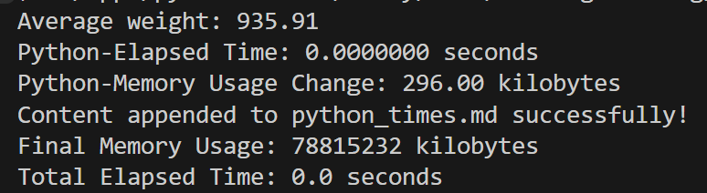
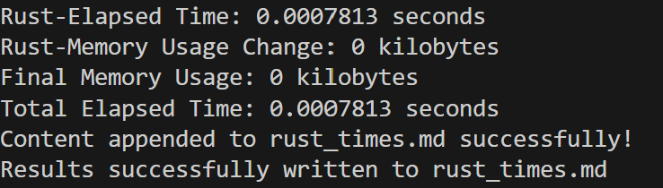

# Python-Rust Comparison

This project takes an existing Python script for data processing and rewrites it in Rust. It compares the speed and resource usage of the two. The  is imported as a csv and it contains 1932-2013 career stats for NFL receivers.

## Rust Files:
* src - contains main.rs and lib.rs Rust scripts
* lib.rs contains a function to get the average of the career_try column in the dataset
* main.rs uses the average function from lib.rs and also tracks run time and memory usage
* Cargo.toml contains dependencies for Rust
* rust_times.md has the outputs of the Rust speed and resource usage
* Tests each operation
* CI/CD pipeline (github actions for Rust)

## Python Files:
* mylib folder which contains average.py to read in the csv and get the average of the career_try column
* main.py to use the average function from average.py and track run time and memory usage
* test_main.py test script
* python_times.md has the outpus of the Python speed and resource usage
* requirements.txt

## Other:
* Makefile
* Dockerfile and devcontainer

## Preparation and usage
1. Open codespaces 
2. Load repo to code spaces
2. Wait for installation of all requirements in requirements.txt
3. Run main.py to run functions and get usage
4. For rust, run `make install` for cargo dependencies
5. Run `cargo build --release`
6. Run `cargo check` to compile 
7. Run `cargo run main` to run functions and get usage information

## Check format and test errors
For the make file, there are make install, lint, format, and test for Rust and Python.  
Those for Python are preceded by `python`, e.g. `make python_install`. 

## Comparison Results:
* Though it looks like Rust takes a bit more time in this case, it has much less memory usage.

|                    |        Rust       |       Python      |     Improvement       |
|:------------------:|:-----------------:|:-----------------:|:-----------------------:|
|  Average of career_try |       935.90908      |       935.90908      | The values are the same |
|    Elapsed Time    | 0.0008351 seconds | 0.00000 seconds |         Python is less         |
|    Memory Usage    |    0 kilobytes    |   78671872.00000 kilobytes  |     Python is much larger              |

