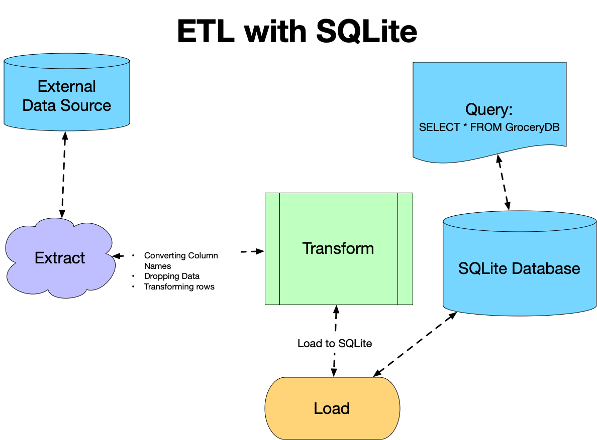
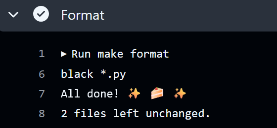
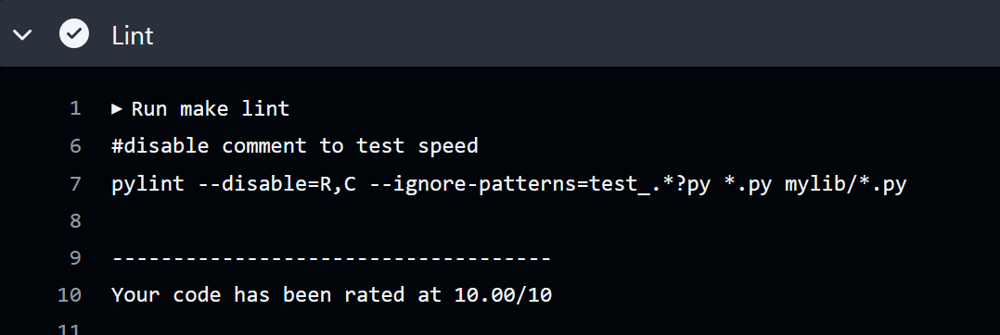
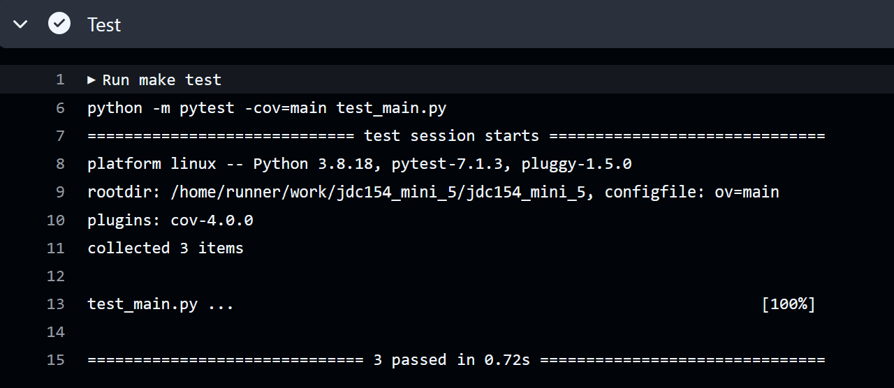
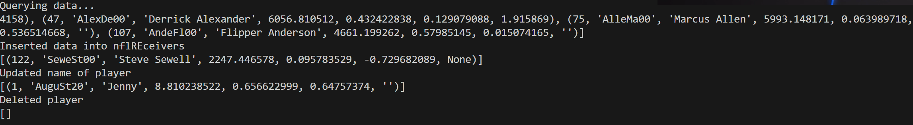
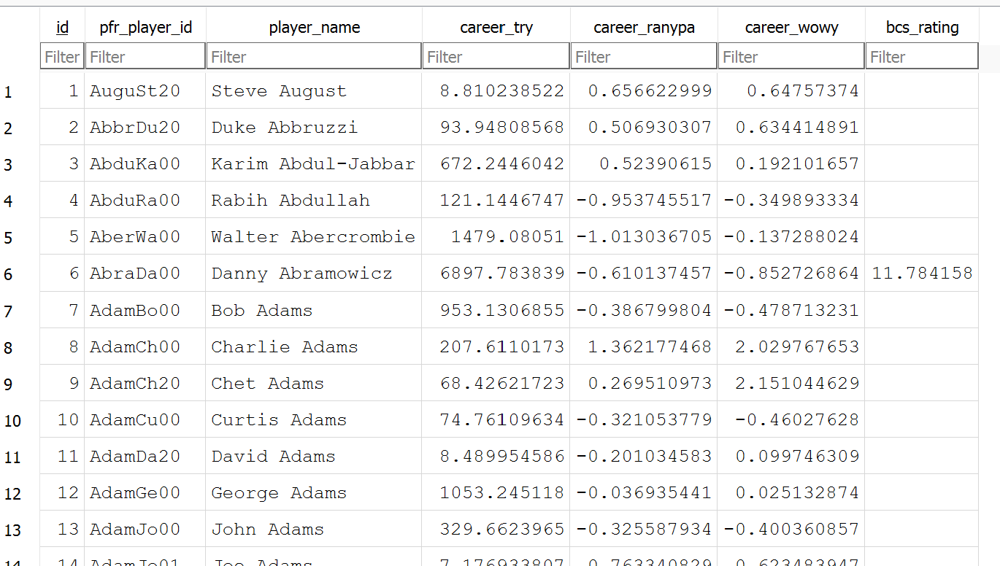

# SQLite Integration

This project introduced sql commands using a SQLite database stored directly in this repository and performs CRUD operations to analyze the data. The  is imported as a csv and loaded in as nflReceivers.db; it contains 1932-2013 career stats for NFL receivers.

## Functionality and commands:
* ETL - extracts data from url (extract.py), transforms data for analysis, and loads data into SQLite database using Python's sqlite3 module (transform_load.py).
* nflReceivers.db
* Perform CRUD operations: create, read, update, and deletes data in table. (query.py)
* Tests each operation
* CI/CD pipeline (github actions)
* requirements.txt
* Makefile
* Dockerfile and devcontainer
* main.py - script to run ETL and CRUD operations
* test_main.py - test script 

## ETL pipeline Overview:

## Preparation and usage
1. Open codespaces 
2. Load repo to code spaces
2. Wait for installation of all requirements in requirements.txt
3. Run main.py to load in database and run queries

## Check format and test errors
1. Format code `make format`

2. Lint code `make lint`

3. Test code `make test`

(alternatively, do all with `make all`)

## CRUD results:

## Database: 
